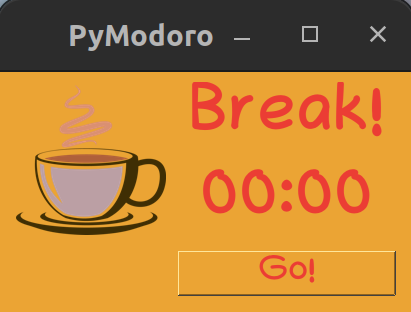

# PyModoro

This is a simple Python application built using the tkinter library that functions as a timer based on the Pomodoro 
Technique. 
When the user clicks the start button, the timer begins, and when it finishes, a cuckoo sound is played.

<p float="left">
   
   
</p>

## About the Pomodoro Technique

The Pomodoro Technique is a time management method developed by Francesco Cirillo in the late 1980s. 
It uses a timer to break work into intervals, traditionally 25 minutes in length, separated by short breaks. 
Each interval is known as a "pomodoro," the plural in English of the Italian word pomodoro (tomato), 
after the tomato-shaped kitchen timer that Cirillo used as a university student.

The technique has been widely adopted by individuals and teams to improve productivity and maintain focus by 
dividing work into manageable intervals, 
allowing for periods of intense concentration and short breaks for rest and rejuvenation.

## Installation

To run the Pomodoro Timer App, you need to install the necessary dependencies. 
The required dependencies are listed in the `requirements.txt` file.

1. Clone the repository to your local machine or download and extract the ZIP file.

2. Open a terminal or command prompt and navigate to the project directory.

3. Install the dependencies using the following command:

   ```shell
   pip install -r requirements.txt
   ```

## Usage

To run the Pomodoro Timer App, follow these steps:

1. Make sure you have installed the required dependencies as mentioned in the installation section.

2. Open a terminal or command prompt and navigate to the project directory.

3. Execute the `main.py` script using the following command:

   ```shell
   python main.py
   ```

4. The application window will open, displaying a start button. Click the start button to begin the timer.

5. The timer will start counting down from the default duration of 25 minutes.

6. Once the timer finishes, a cuckoo sound will play to indicate that the pomodoro interval has ended.

7. A new timer starts for 5 minutes that indicates the break. After the timer finishes, another cuckoo sound is played.

8. You can start another pomodoro by clicking the start button again.

9. To quit the application, simply close the window or press Ctrl+C in the terminal or command prompt.

## Contributing

Contributions to this project are welcome. If you find any issues or have suggestions for improvements, please feel free to open an issue or submit a pull request on the project's GitHub repository.

## License

This Pomodoro Timer App is released under the [MIT License](LICENSE).